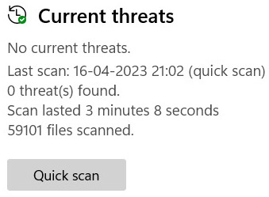
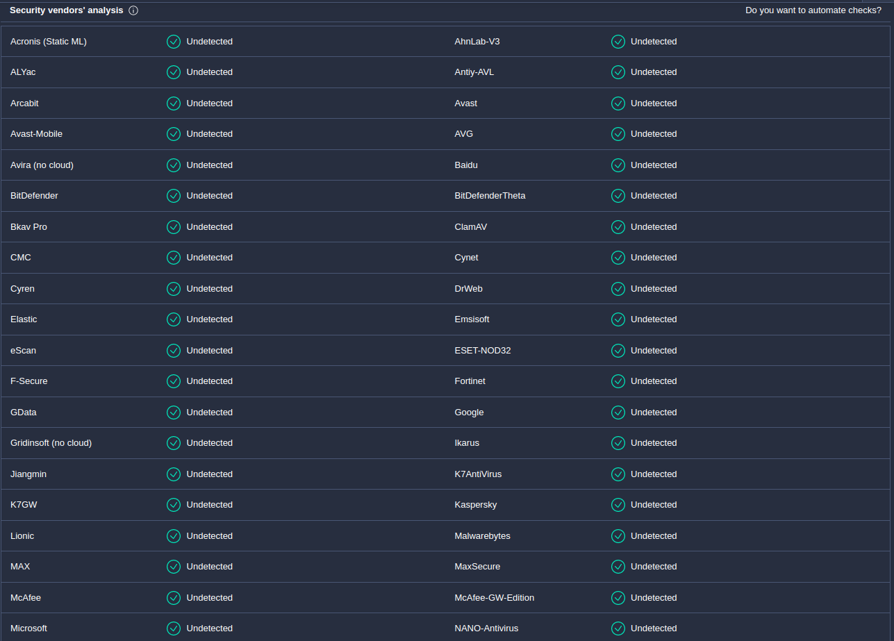
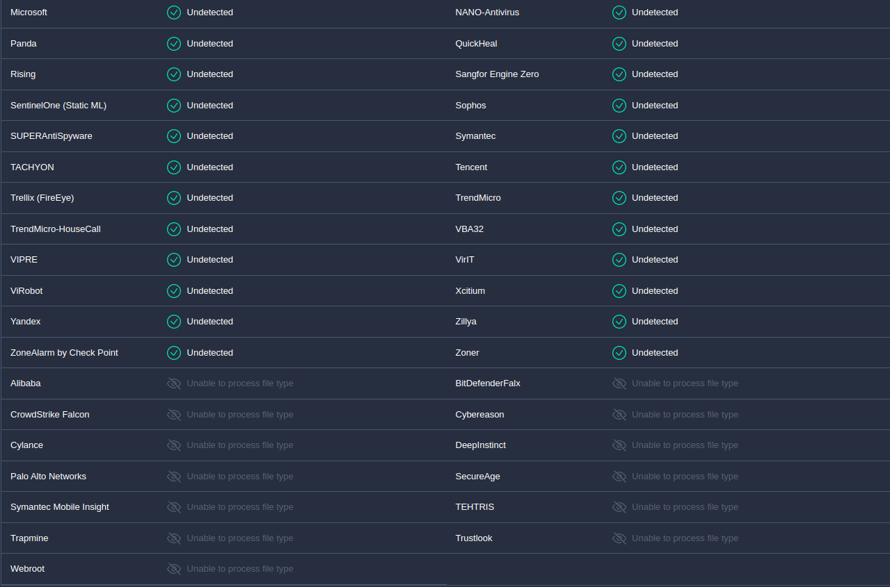
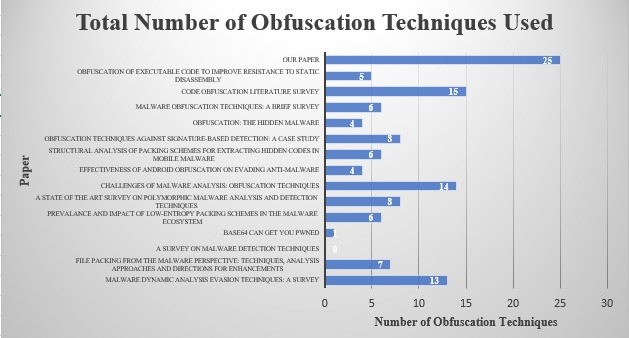
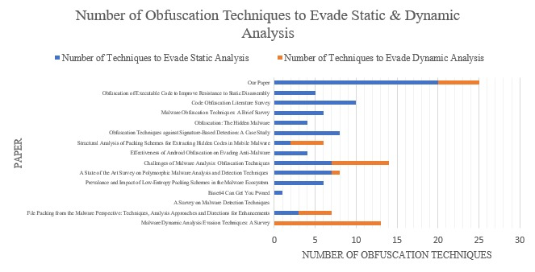
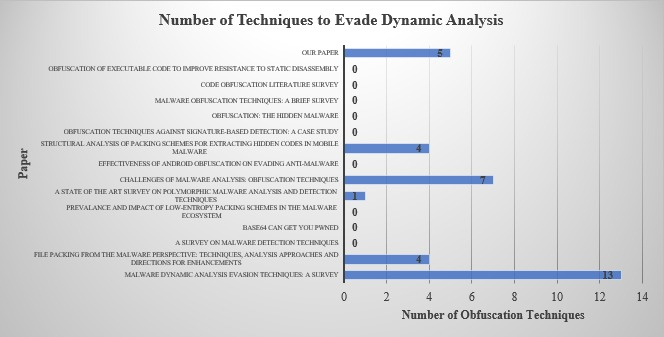
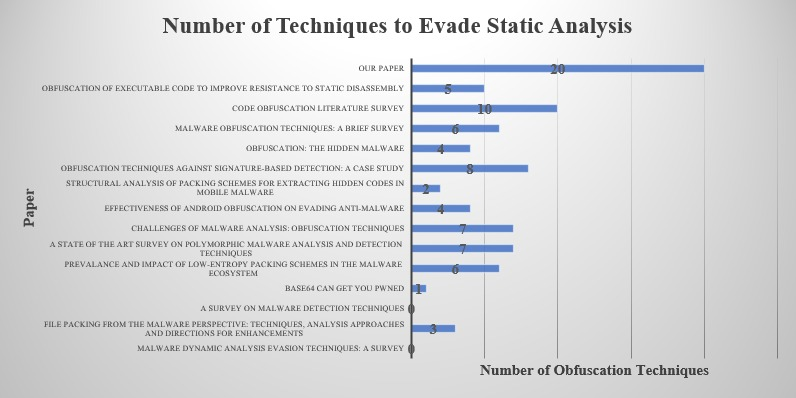

# A Lightweight Fused Obfuscation Framework to Evade Static & Dynamic Analysis

## 🔀 Obfuscation Control Flow


## 📌 Prerequisites

### 💻 System requirement :

1. Any system with basic configuration.
2. Operating System : Any (Windows / Linux / Mac).

### 💿 Software requirement :

1. Updated browser
2. Python installed (If not download it [here](https://www.python.org/downloads/)).
3. Any text editor of your choice.

## 🔧 Installation & Setup

### 🏗️ Clone The Repository :
```
$ git clone https://github.com/NVombat/Information-Stealing-Malware.git
```

### ➕ Install Dependencies :
```
$ cd obfuscation
$ pip install -r requirements.txt
```

### 🔐 Generate Encryption Keys :
```
$ cd cryptography
$ python3 generate_key.py
$ cd ..
```

### 📝 Setup .env File :
```
Refer to .env.example and create project secrets
Store Encryption Key
Setup Email API keys and attacker Email ID
Setup Base Path for storing logged information
Setup Path for application log file
```

### 🚀 Run Malware :
```
$ python3 malware.py
```

### 🧐 Access Logged & Stolen Data :
```
Go to the Attacker Email ID
If Logged & Stolen Data Reports do not show up in the INBOX then check the SPAM folder
Download the encrypted files

Run decryption script:
$ cd cryptography
$ python3 decrypt_file.py
$ cd ..
```

## 💡Making The Framework Lightweight

```
- Optimize Code
- Minimize Resource Usage
- Avoid Unnecessary Calculations
- Use Concurrency
- Use Lazy Loading
- Use Efficient I/O Operations
- Optimize Data Storage
- Use Platform-Specific Optimizations
```

## 🧪 Obfuscation Techniques Used

### 🛂 Techniques To Evade Static Analysis :

```
- Removing Comments
- Removing Type Hints
- Removing Whitespace
- Manipulating Strings
- Manipulating Numbers
- Adding Dead Parameters
- Dead Code Insertion
- Garbage Bytes Insertion
- Jump With Same Target
- Subroutine Reordering
- Instruction Substitution
- Instruction Reordering
- Code Transposition
- Try Catch Statements
- Opaque Predicates
- Identifier Renaming
- Encryption and Packing
- Control Flow Graph Flattening
- Method Overloading
- Encryptor and Decryptors
```

### 🔍️ Techniques To Evade Dynamic Analysis :

```
- Timing-Based Method
- User Interaction-Based Method
- Killing Common Processes
- Using Windows API
- Detecting A Sandbox Environment
```

## 📸 Output & Results

### 📌 Windows Defender Scan Results :



### 📌 Virus Total Scan Results (a) :


### 📌 Virus Total Scan Results (b) :



### 📌 Virus Total Scan Results (c) :



### 📌 Total Number of Obfuscation Techniques Used :



### 📌 Number of Obfuscation Techniques to Evade Static & Dynamic Analysis :



### 📌 Number of Techniques to Evade Dynamic Analysis :



### 📌 Number of Techniques to Evade Static Analysis :



### 📌 Other Features :

- Determining File Information
- Screen Video Recording
- Front Camera Video Recording

## 📄 Publication Details

SUBMITTED FOR PUBLICATION TO COMPUTERS & SECURITY JOURNAL